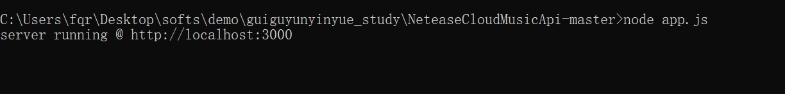
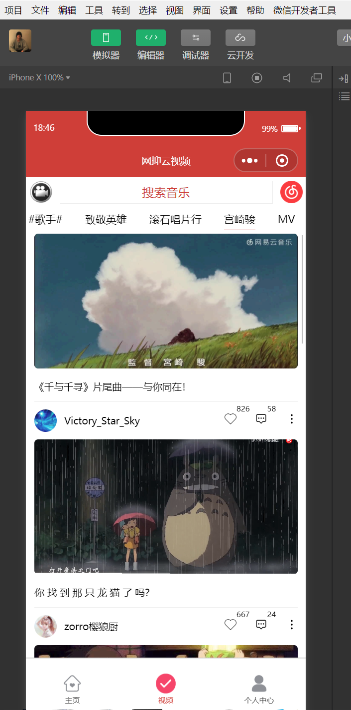
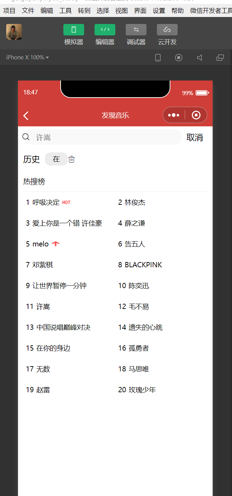
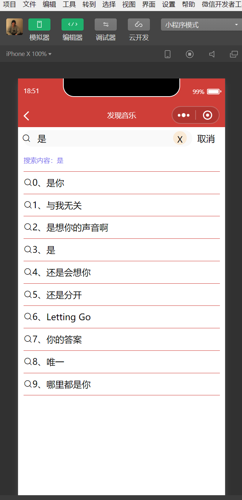
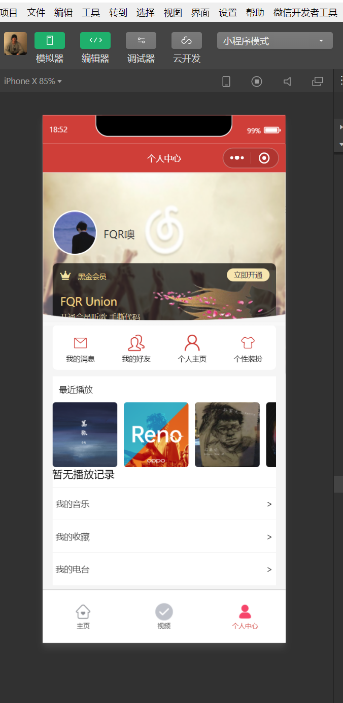

# 微信小程序仿网易云音乐

#### 介绍
这是一个仿网易云的微信小程序，现在分享出来，大家一起互相学习学习^_^~~

#### 使用说明

1. 可以在下面修改自己的服务器地址

 

2. 服务器文件夹是NeteaseCloudMusicApi-master，在NeteaseCloudMusicApi-master文件夹下运行 node app.js打开服务器

 
3.  xxxx

#### 效果预览

可以扫码体验下哦~

#### 体验地址
https://gitee.com/fqrhello_world/de-watermark/raw/master/gh_697101a8e05a_344.jpg

#### 特技

1.  使用 Readme\_XXX.md 来支持不同的语言，例如 Readme\_en.md, Readme\_zh.md
2.  Gitee 官方博客 [blog.gitee.com](https://blog.gitee.com)
3.  你可以 [https://gitee.com/explore](https://gitee.com/explore) 这个地址来了解 Gitee 上的优秀开源项目
4.  [GVP](https://gitee.com/gvp) 全称是 Gitee 最有价值开源项目，是综合评定出的优秀开源项目
5.  Gitee 官方提供的使用手册 [https://gitee.com/help](https://gitee.com/help)
6.  Gitee 封面人物是一档用来展示 Gitee 会员风采的栏目 [https://gitee.com/gitee-stars/](https://gitee.com/gitee-stars/)
